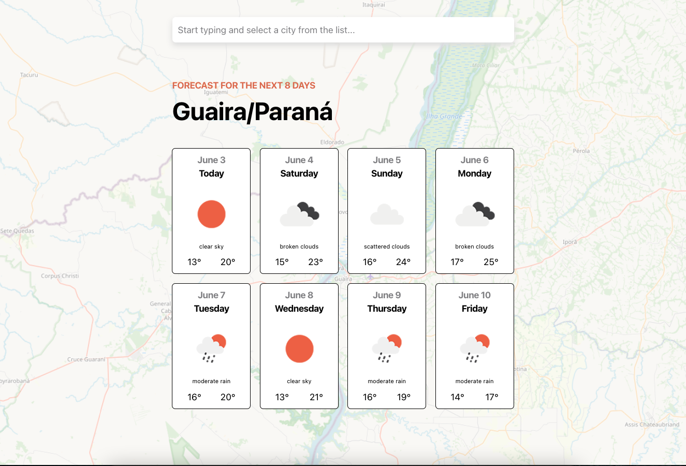

<h3>Hatchways - Frontend Assessment Practice Project</h3>

  <p>
    The goal of this assessment was to replicate the frontend application provided (as close as
possible). You are allowed to use any frontend framework (React.js, Vue.js, etc.) or use
plain Javascript, HTML, and CSS. We recommend using a frontend framework as parts of the assessment will be difficult without it.
  </p>
  
 The finished application should look like this:


More info about this assessment can be found [here](https://hatchways.notion.site/hatchways/Front-End-Practice-Assessment-0a0723b34cae4e41912ff6bf5b7c2b77)

<!-- ABOUT THE PROJECT -->

### How this assessment was approached

Since the application request was simple with hard coded values, I decided to expand it promoting a better user experience with dynamic values, using the same tools provided with a personal touch. These are the results:



You can also check a live demo in the link below (if the application won't work the number of requests reached the limit for the free plan)

### Techs used

- [Typescript](https://www.typescriptlang.org/)
- [React.js](https://reactjs.org/)
- [Jest](https://jestjs.io/)
- [styled-components](https://styled-components.com/)
- [OpenWeatherApi](https://openweathermap.org/api)
- [React Leaflet](https://react-leaflet.js.org/)

<!-- GETTING STARTED -->

## Getting Started

To get a local copy up and running follow these simple example steps.

```
gh repo clone codearis/hatchways-frontend-practice
```

```
cd project
```

```
yarn install
```

<!-- USAGE EXAMPLES -->

## Usage

The app will require you to sign-up at OpenWeatherAPI to get an API key.
With your API key, create a `.env` file at `./project` folder with the variable `REACT_APP_OPEN_API = "api key"`

<!-- CONTRIBUTING -->

## Contributing

Contributions are what make the open source community such an amazing place to learn, inspire, and create. Any contributions you make are **greatly appreciated**.

If you have a suggestion that would make this better, please fork the repo and create a pull request. You can also simply open an issue with the tag "enhancement".
Don't forget to give the project a star! Thanks again!

<!-- LICENSE -->

## License

Distributed under the MIT License. See `LICENSE.txt` for more information.

<!-- CONTACT -->

## Contact

- [Twitter](https://twitter.com/codearis)
- [LinkedIn](https://www.linkedin.com/in/ariel-christmann/)
- codearis@icloud.com


<p align="right">(<a href="#top">back to top</a>)</p>
